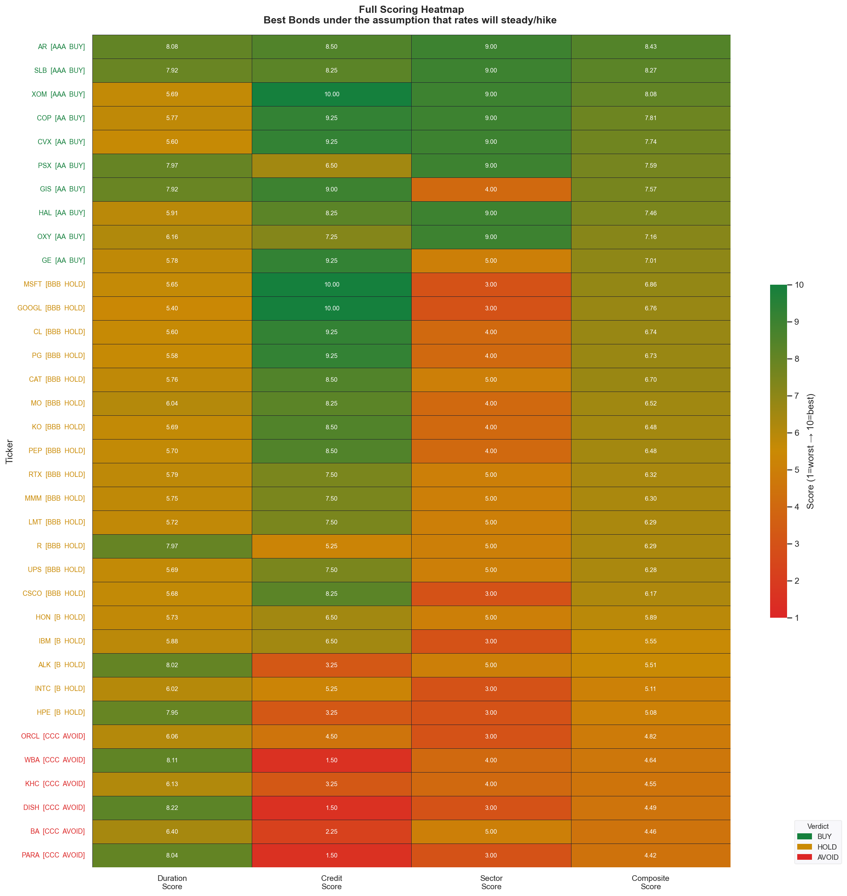
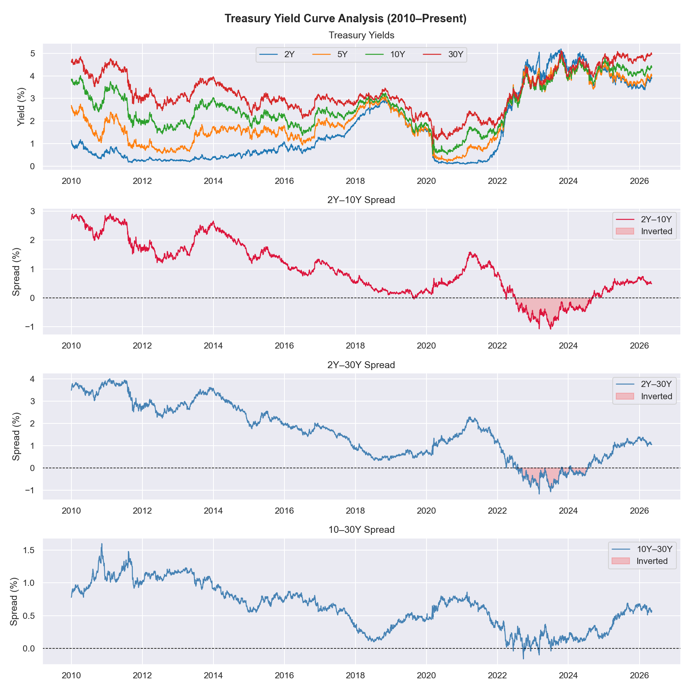
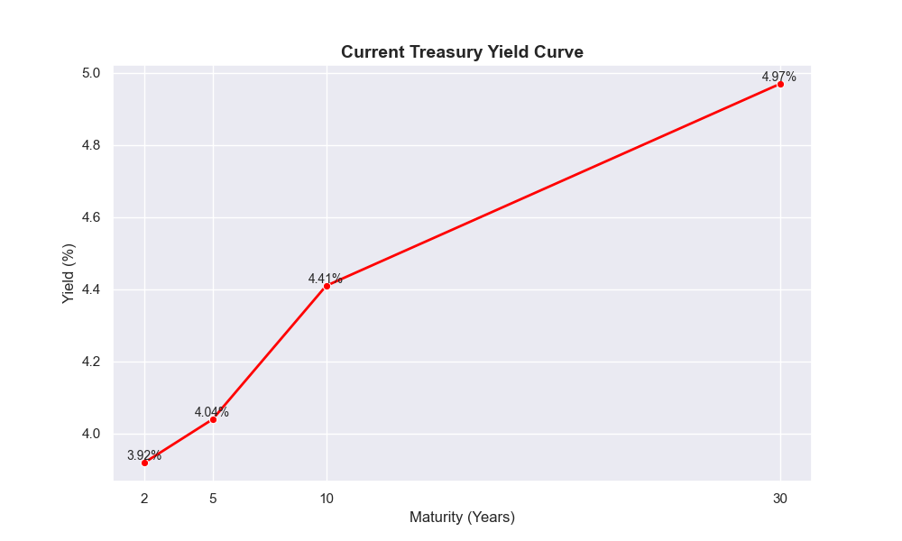
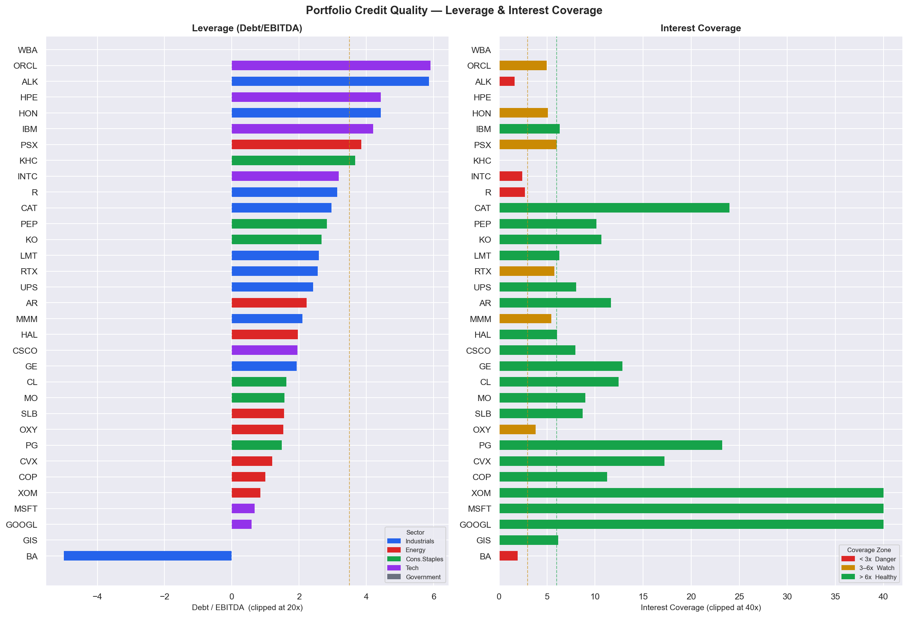
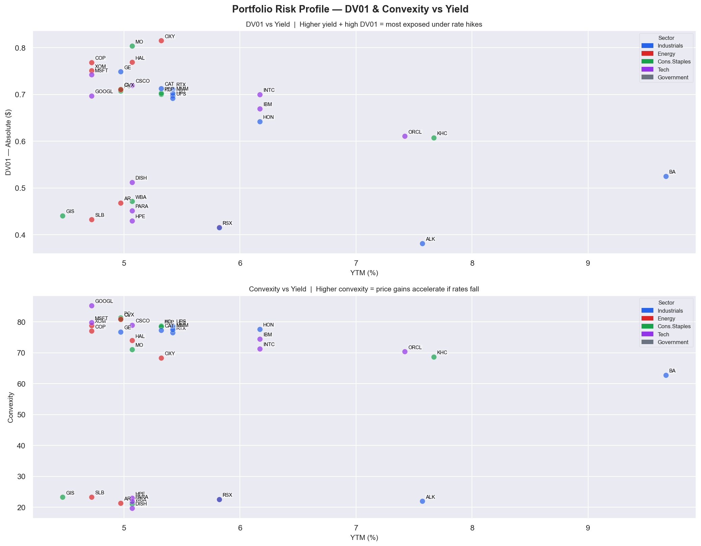
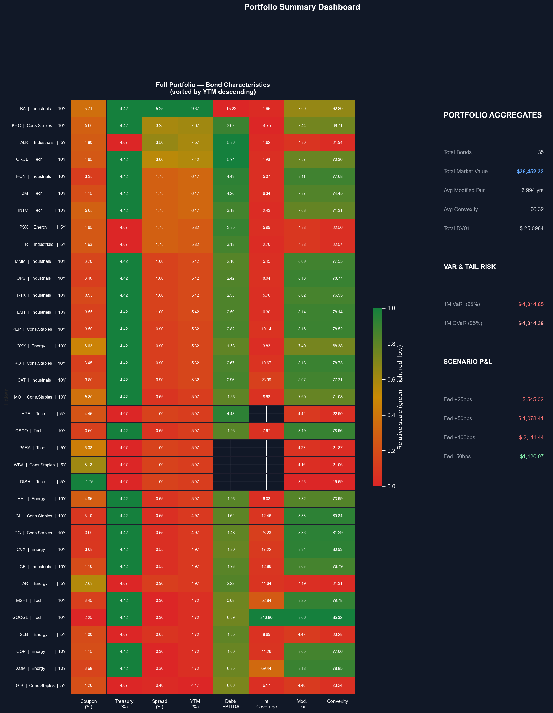

# Fixed_Income_Risk_Dashboard
Personal Learning Project

Click Here to view the Visual Dashboard: https://fixedincomeriskdashboard-fhasrhbwnw8799rzwfsrjh.streamlit.app/

# Overview
I built this project to gain a hands-on introduction to fixed income markets. Starting from pulling Treasury data, I was able to create a macro-driven bond scoring system based on my predictions of where the US Economy will go. Each step in this project allowed me to learn a little more about the mechanics of how bonds are priced, how risk is measured, and how a macro view translates into portfolio decisions.

The project is written entirely in Python using FRED API data, Yahoo Finance financials, and standard data science libraries (pandas, numpy, matplotlib, seaborn)

# PROJECT PREVIEW

# METHODOLOGY
Step 1 — Treasury & Macro Data Pipeline

The first step was pulling clean historical data from the Federal Reserve's FRED database. Using a FRED API, I pulled five series: the 2Y, 5Y, 10Y, and 30Y Treasury yields, and the daily Fed Funds Rate (DFF). All series were stored in a single pandas DataFrame, forward-filled to align daily and monthly series on the same index, and trimmed from 2000 onward to capture two full rate cycles, including the 2008 financial crisis and the 2020 COVID shock — both critical for realistic risk modeling later.

A key design decision here was using DFF (daily effective fed funds) rather than the monthly FEDFUNDS series, giving us more detailed data on monetary policy.

Step 2 — Yield Curve Visualization & Spread Analysis

The next thing I did was visualize the treasury yield data. Four plots were produced:

Historical yield time series (2010–present) — all four tenors plotted together. You can visually see the 2022 tightening cycle, where the Fed raised rates from near-zero to 5%+ in under two years, the fastest hiking cycle in modern history.

2Y–10Y and 2Y–30Y spreads with inversion shading: the red-shaded regions mark periods where the spread went negative, meaning short-term rates exceeded long-term rates. This is called a yield curve inversion and has historically preceded every U.S. recession since 1970. The 2022–2023 inversion was one of the deepest and longest on record.

The 10Y-30Y spread represents the final plot purely for semblance's sake.
To calculate the spread, the formula is:
df["2Y10Y"] = df["10Y"] - df["2Y"] & df["2Y30Y"] = df["30Y"] - df["2Y"]. Negative values represent an inversion.

# Step 3 — Mock Bond Portfolio & Risk Metrics
Portfolio Construction

A portfolio of 35 corporate bonds was constructed across four sectors — Industrials, Energy, Consumer Staples, and Technology — plus four risk-free U.S. Treasury bonds (2Y, 5Y, 10Y, 30Y). Roughly half the portfolio consists of strong investment-grade names (Microsoft, ExxonMobil, Procter & Gamble, Caterpillar), and the other half consists of leveraged, distressed, or declining names (Boeing, Walgreens, DISH/EchoStar, Kraft Heinz). This contrast was important for making the risk metrics and macro scoring meaningful.

Corporate yields were constructed as: YTM = Matched Treasury Yield + Credit Spread

The credit spread was derived from each company's real financials pulled from Yahoo Finance (yfinance) — specifically Debt/EBITDA and Interest Coverage ratio. Higher leverage and lower coverage = wider spread

Risk Metrics
Five risk metrics were computed for every bond in the portfolio:

Price — the present value of all future cash flows (coupons + face value) discounted at the bond's yield to maturity. This is the fundamental bond pricing equation. Price and yield always move in opposite directions.

Macaulay Duration — the weighted average time until you receive your cash flows back, measured in years. A 10Y zero-coupon bond has a duration of exactly 10. A 10Y bond paying a 6% coupon has a shorter duration because you are receiving cash every six months, pulling your average payback date forward.

Modified Duration — Macaulay Duration divided by (1 + y/2). This is the actionable risk number: it tells you the approximate percentage change in price for a 1% move in yield. A bond with a Modified Duration of 8 loses roughly 8% of its value if rates rise 1%.

Convexity — the second-order correction to Modified Duration. The price/yield relationship is a curve, not a straight line. Convexity captures the curvature: for large yield moves, convexity means price gains are larger than duration predicts and price losses are smaller. All else equal, higher convexity is always better for the bondholder.

DV01 (Dollar Value of 01) — Modified Duration expressed in dollar terms per basis point. If your portfolio has a total DV01 of −$6.63, a +1bp move in rates costs the portfolio $6.63. A +100bp move costs $663. This is the metric traders actually use day-to-day because it converts abstract duration into concrete P&L.

Key Rate Duration (KRD) — unlike Modified Duration, which assumes the whole yield curve shifts in parallel, KRD measures sensitivity to a move at one specific tenor while holding the rest of the curve constant. A 10Y bond only has KRD exposure at the 10Y point. This metric becomes critical when doing scenario analysis involving curve steepeners and flatteners rather than parallel shifts.

# Step 4 — Historical Value at Risk (VaR)
VaR was computed using the historical simulation method. Rather than assuming yield changes are normally distributed (parametric VaR) or drawing random scenarios (Monte Carlo), we took the actual history of monthly yield changes from 2000 to present — roughly 300 real months including 2008 and 2020 — and replayed each month's yield moves on the current portfolio.
For each historical month, the yield change at each tenor (2Y, 5Y, 10Y, 30Y) was applied to every bond matched to that tenor, and the resulting P&L was recorded. After 300 simulations, the 5th percentile of the P&L distribution is the 1 month 95% VaR: the portfolio loss that was exceeded in only 5% of historical months

We also computed CVaR (Conditional VaR, also called Expected Shortfall) — the average loss in the worst 5% of months. CVaR is a more complete risk measure than VaR because it tells you not just the threshold but the average magnitude of the tail losses beyond it.
Starting from 2000 rather than 2010 was a deliberate choice. The 2008 financial crisis and the 2000–2002 recession are exactly the kind of extreme events that VaR is supposed to capture. Excluding them would have understated the true tail risk of the portfolio.

# Step 5 — Macro View & Bond Scoring System
The Macro View
As of the project date, the macroeconomic environment was characterized by three concurrent pressures: geopolitical risk from the Iran conflict driving energy price surges, inflation running above trend for the third consecutive year, and a Federal Reserve caught between political pressure from the administration for rate cuts and the data-driven reality that inflation had not been sufficiently tamed. The base case was that the Fed would hold rates steady or raise them, with rate cuts unlikely in the near term.
This thesis has three direct implications for bond selection:
Rates steady or higher — duration is the enemy. Long-duration bonds (10Y and 30Y) lose significant value as yields rise. Short-duration bonds (2Y, 5Y) have much smaller price sensitivity and are the natural safe harbor in this environment.
Credit spreads widen — in a stagflationary environment with slowing growth and persistent inflation, credit conditions tighten. Weak credits get punished disproportionately. Companies with high leverage or thin interest coverage face rising borrowing costs precisely when their operating environment is deteriorating.
Energy outperforms — rising energy prices directly improve the revenues and cash flows of oil and gas companies. ExxonMobil, Chevron, and ConocoPhillips become better credits when oil is expensive, even as the rest of the market weakens. This is a rare case where the macro headwind for most of the portfolio is a direct tailwind for one sector.

The Scoring System
Each bond was scored on three dimensions, then combined into a composite score:
Duration Score (40% weight) — linear scale from 1 to 10 where short duration scores high and long duration scores low. Computed as 10 - (ModDur - 1) × (9/15), clamped to [1, 10]. Every additional year of duration costs 0.6 score points under this model.
Credit Score (40% weight) — averaged from two sub-scores. The Debt/EBITDA sub-score penalizes leverage: below 1x scores 10, above 7x scores 1.5, with Boeing's negative EBITDA flooring immediately at 1. The Interest Coverage sub-score rewards ability to service debt: above 10x scores 10, below 1.5x scores 1.5.
Sector Tailwind Score (20% weight) — a manual overlay encoding the macro view directly. Energy scores 9 (surging revenues), Government scores 6 (safe but duration-exposed), Industrials 5 (mixed), Consumer Staples 4 (defensive but leveraged names at risk), Tech 3 (HY tech gets double-hit from rates and spreads).

Credit Ratings
Composite scores were mapped to a shadow credit rating system:
Score  Rating  Verdict

> 8.0  AAA      BUY

> 7.0  AA       BUY

> 6.0  BBB      HOLD

> 5.0  B        HOLD

≤ 5.0  CCC      AVOID

Step 6 — Streamlit Dashboard
An interactive dashboard was built in Streamlit with the help of Cluade CoWork to visualize our findings and dynamically show portfolio effects.
The Portfolio Summary page shows a full sortable bond table, sector breakdowns by market value and DV01, spread distribution charts, and a duration vs spread scatter plot. The Scenario Analysis page has two sliders — a parallel shift from −200 to +200bps and a steepener/flattener twist from −100 to +100bps — that reprice the entire portfolio and show P&L by bond and by sector in real time. 
Link: https://fixedincomeriskdashboard-fhasrhbwnw8799rzwfsrjh.streamlit.app/

# GRAPHS

Graph 1 — Leverage vs Interest Coverage

Two side-by-side horizontal bar charts ranking all 35 corporate bonds.
This graph shows important data for credit analysis. Which companies have risky debt, which can comfortably service their debt?

Graph 2 — Full Scoring Heatmap 

All bonds are ranked top to bottom by composite score under my macro assumption. Each row shows all four scoring components — Duration Score, Credit Score, Sector Score, Composite Score — on a red-to-green color scale.

Graph 3 — DV01 & Convexity vs Yield

The top panel plots DV01 absolute value against YTM for every bond. Bonds that are both high-yield and high-DV01 are the most exposed under this macro view — they offer a high yield as compensation for credit risk but will lose the most in dollar terms if rates rise. The bottom panel plots convexity against YTM. Higher convexity bonds gain more than they lose for a given yield move, which is an asymmetric benefit that pure duration analysis misses.

Graph 5 — Portfolio Summary Heatmap + Aggregates

The full portfolio in one view, showing all bond characteristics. 
The right panel shows all portfolio-level aggregates: total market value, average modified duration, average convexity, total DV01, 1-month 95% VaR, CVaR, and scenario P&L for four rate shocks.

Key Takeaways
Duration is the dominant risk factor in a rising rate environment. 

Credit spreads and rate risk are compounding, not independent.

Energy is the macro-consistent outlier.

Disclaimer
This project was built for educational purposes only. The credit scoring model is a simplified framework and does not reflect the methodologies of actual rating agencies.

